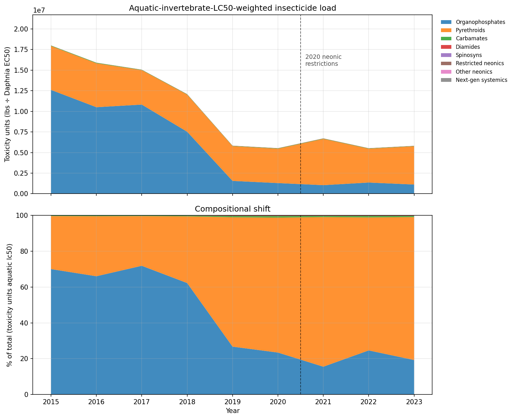
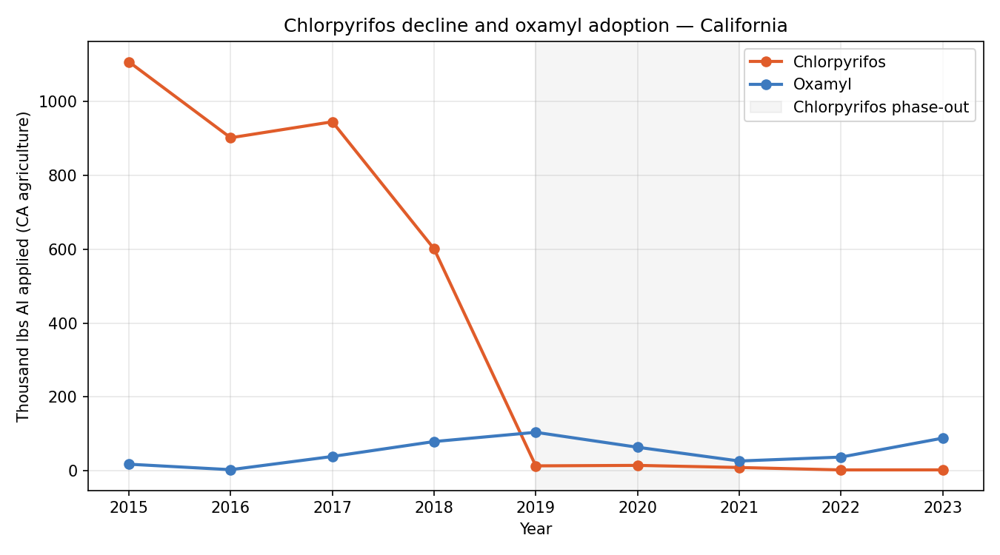
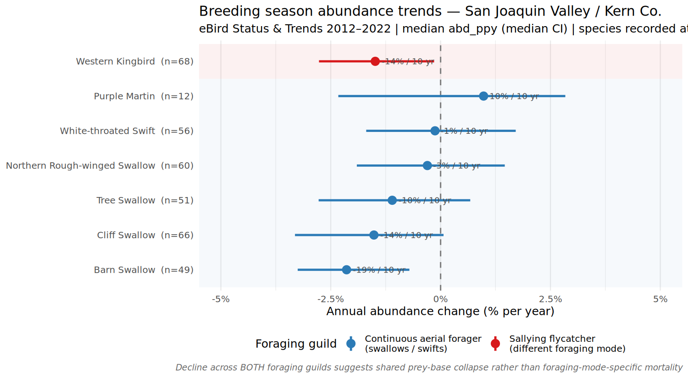
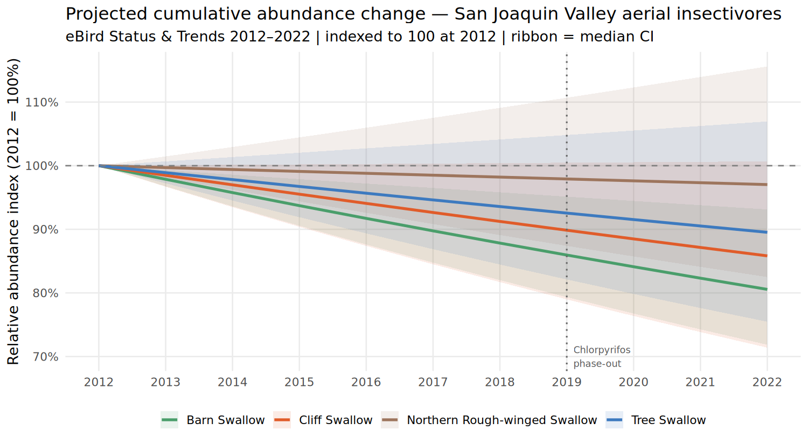
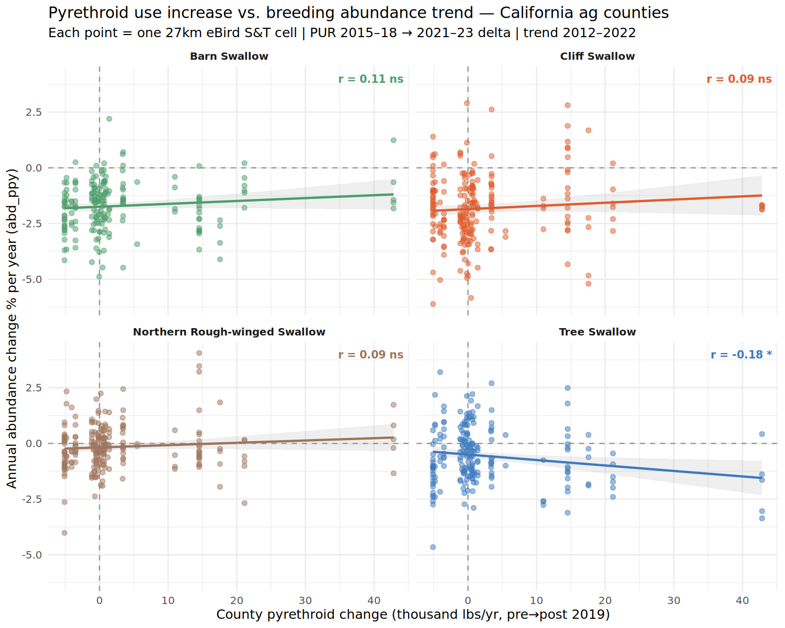

# Aerial Insectivore Trends and Agricultural Pesticide Use in California's San Joaquin Valley

**A Level 1 exposure characterization supporting a proposed CDPR Ecosystem Monitoring study**

Doug Moody & Dennis Jongsomjit — Point Blue Conservation Science — May 2026

*Preliminary analysis — not for citation without author approval*

---

> **Summary**
>
> California's 2019 chlorpyrifos cancellation provides a natural experiment for examining
> how pesticide regime shifts affect non-target wildlife. Analysis of California Department
> of Pesticide Regulation (CDPR) use data from 2015–2023 shows that the organophosphate
> collapse was followed by a compositional shift in the agricultural insecticide load:
> pyrethroids now account for roughly 77% of the aquatic invertebrate toxicity burden,
> up from 28% in 2015. A partial substitution toward oxamyl — a carbamate approximately
> ten times more acutely toxic to birds than chlorpyrifos — is concentrated in Kings County
> cotton. Separately, eBird Status & Trends data (2012–2022) show that five aerial
> insectivore species breeding in the San Joaquin Valley declined at 1–2% per year over
> this period. Notably, declines appear across two distinct foraging guilds (continuous
> aerial foragers and sallying flycatchers), which is consistent with — though not
> attributable to — prey-base disruption. A county-level spatial correlation between
> pyrethroid use increase and bird abundance trends yields a weak negative signal for
> Tree Swallow and null results for three other swallow species. These patterns, taken
> together, motivate a targeted field study capable of making finer-grained causal
> inferences than remote data alone can support.

---

## 1. Introduction

Aerial insectivores — birds that capture flying invertebrates on the wing — have
declined more steeply than most other North American bird guilds over the past five
decades (Rosenberg et al. 2019, Nebel et al. 2010). Li et al. (2020), using county-level
panel data across 2,200 U.S. counties, found that increases in neonicotinoid pesticide use
between 2008 and 2014 were associated with statistically significant declines in
insectivorous bird diversity, consistent with prey-base suppression as a contributing
mechanism. Multiple additional mechanisms have been proposed, including changes in
breeding and wintering habitat and climate-mediated phenological mismatches. Distinguishing
among these requires both robust exposure data and spatially matched biological monitoring,
neither of which has been systematically collected for California's most productive
agricultural landscapes.

California's San Joaquin Valley presents an unusual opportunity. The valley concentrates
a large fraction of California's agricultural pesticide use, supports breeding populations
of at least nine aerial insectivore species, and in 2019 experienced a near-complete
withdrawal of chlorpyrifos — at the time the state's dominant agricultural insecticide —
following CDPR's cancellation order. This regulatory event functions as a quasi-natural
experiment: exposure did not simply decrease, it shifted in character, with growers
adopting alternative chemistries that differ substantially in their toxicological profiles
for both aquatic invertebrates and birds.

This document summarizes a preliminary analysis of CDPR Pesticide Use Report (PUR)
data and eBird Status & Trends (S&T) trend estimates for the San Joaquin Valley /
Kern County region. The goal is to characterize the direction and magnitude of changes
in pesticide toxicity load and to examine whether those changes are spatially associated
with aerial insectivore population trends — not to claim attribution, but to assess
whether the patterns are coherent enough to warrant a targeted field investigation.

---

## 2. Methods

### 2.1 Pesticide use data

Annual pesticide use records were obtained from the CDPR PUR database for
2015–2023. Records were filtered to agricultural applications using CDPR site codes
(<65,000), yielding 9 years of county-level use data for all 58 California counties.
Fourteen insecticide active ingredients were extracted and grouped by chemical class
(organophosphates, pyrethroids, carbamates, neonicotinoids, and others). Raw application
mass (pounds of active ingredient, lbs AI) was used for volume trends; toxicity-weighted
loads were computed as lbs AI ÷ published LC50 (aquatic: *Daphnia magna* 48h EC50
in μg/L; avian: acute oral LD50 in mg/kg). Toxicity values were sourced from the
University of Hertfordshire Pesticide Properties DataBase (PPDB; Lewis et al. 2016) as
primary reference and cross-checked against the U.S. EPA ECOTOX Knowledgebase.

### 2.2 Bird abundance trends

Breeding-season abundance trend estimates were extracted from eBird Status & Trends
2022 Data Products (Fink et al. 2023) using the `ebirdst` R package.
Trends are expressed as annual proportional change in relative abundance
(*abd_ppy*, % per year) modeled over 2012–2022 at the scale of ~27 km grid cells.
Cells were filtered to two focal regions: the San Joaquin Valley / Kern County area
(lon −120.5 to −118.0, lat 34.8 to 36.8) and the Sacramento Valley rice corridor
(lon −122.5 to −121.0, lat 38.5 to 40.5) as a reference comparison. Nine aerial
insectivore species recorded at Kern National Wildlife Refuge eBird hotspots were
targeted; trend data were available for seven of these (Lesser Nighthawk and Bank
Swallow lacked sufficient trend coverage in the SJV).

### 2.3 Spatial correlation analysis

For the four swallow species with sufficient SJV cell coverage, a county-level
pyrethroid delta was computed (mean annual lbs AI, 2021–2023 minus 2015–2018) from
the PUR data and spatially joined to S&T grid cells using county polygon boundaries
(U.S. Census TIGER/Line shapefiles via the `tigris` R package). Analysis
was restricted to 32 agricultural counties to reduce confounding from urban pyrethroid
use patterns. Pearson correlation was computed between county-level pyrethroid change
and cell-level *abd_ppy* for each species.

---

## 3. Results

### 3.1 Pesticide use: a shift in toxicological character, not just volume

Total agricultural insecticide application in California declined substantially over
the study period, driven almost entirely by the chlorpyrifos cancellation. Statewide
chlorpyrifos use fell from roughly 1.1 million lbs AI per year in 2015 to near zero by
2020 — a 98% reduction concentrated in a single growing season (Figure 1, top panel).
This loss was not offset by comparable growth in any single replacement chemistry,
and total toxicity-weighted load to aquatic invertebrates dropped by approximately two-thirds
between 2015 and 2019.

However, the compositional story is more complex. Because chlorpyrifos had relatively
modest aquatic toxicity per pound compared to pyrethroids, its removal disproportionately
benefited aquatic invertebrates less than the raw volume decline suggests. Pyrethroids —
already present throughout the study period — increased their share of the
toxicity-weighted load from approximately 28% in 2015 to 77% in 2023, even as their
absolute use in lbs AI declined modestly (Figure 1, bottom panel). In practical terms,
the agricultural insecticide environment became substantially more hazardous to aquatic
invertebrates on a per-pound basis.

**Figure 1.** Aquatic invertebrate toxicity-weighted insecticide load for California
agriculture, 2015–2023. *Top:* absolute toxicity units (lbs AI ÷ *Daphnia magna* 48h EC50),
stacked by chemical class. The organophosphate area collapses 2018–2019, corresponding to
the chlorpyrifos cancellation; total load declines by ~65%. *Bottom:* compositional share
of total toxicity load. Despite the volume reduction, pyrethroid share grew from ~28% to
~77%, reflecting pyrethroids' much higher aquatic toxicity per unit mass. Toxicity values
from Hertfordshire PPDB (Lewis et al. 2016); PUR data from CDPR.

### 3.2 Partial substitution: chlorpyrifos toward oxamyl

Within the carbamate class, a separate pattern emerged that has implications for avian
toxicity rather than aquatic toxicity. Oxamyl — registered primarily for cotton, potatoes,
and cucurbits — increased from approximately 18,000 to 88,000 lbs AI statewide between
2016 and 2019, coinciding with the chlorpyrifos phase-out period (Figure 2). Use has
remained elevated through 2023. Approximately 75% of California's oxamyl use is
concentrated in Kings County, suggesting the signal is driven largely by San Joaquin
Valley cotton production.

This matters disproportionately for avian toxicity. Oxamyl's acute oral LD50 in
Bobwhite Quail is 3.16 mg/kg, placing it in the "extremely toxic" category; chlorpyrifos
LD50 is 32 mg/kg, roughly ten times less acutely toxic to birds on a per-pound basis.
If oxamyl use genuinely displaced chlorpyrifos in the same fields and for similar target
pests, the avian toxicity burden from carbamates may have increased even as the
organophosphate burden fell. Whether growers, field staff, or non-target wildlife are
actually exposed at biologically significant levels is unknown.

**Figure 2.** Statewide annual use of chlorpyrifos and oxamyl in California agriculture,
2015–2023 (thousand lbs AI, agricultural sites only). The shaded region marks the
chlorpyrifos phase-out window. Oxamyl increased ~5× between 2016 and 2019 and has remained
elevated, consistent with partial substitution in San Joaquin Valley cotton. Note the
ordinal scale difference: oxamyl at its peak is about 10% of chlorpyrifos at its
pre-cancellation peak, but is ~10× more acutely toxic to birds per pound. PUR data from CDPR.

### 3.3 Bird abundance trends: consistent declines across the San Joaquin Valley

eBird S&T trend estimates (2012–2022) for seven aerial insectivore species in the
San Joaquin Valley show a consistent pattern of modest but widespread decline. Median
annual abundance change ranges from −2.1%/yr (Barn Swallow) to +1.0%/yr (Purple Martin),
with five of seven species showing negative median trends (Table 1, Figure 3).

**Table 1.** eBird Status & Trends annual abundance trends for aerial insectivores in the
San Joaquin Valley / Kern County region, 2012–2022.

| Species | Guild | SJV cells (n) | abd_ppy (%/yr) | 95% CI | % cells declining | 10-yr projected |
|---|---|---|---|---|---|---|
| Barn Swallow | Continuous | 49 | **−2.14** | −3.25, −0.71 | 96% | −19% |
| Cliff Swallow | Continuous | 66 | −1.52 | −3.31, +0.07 | 91% | −14% |
| Western Kingbird | Sallying | 68 | **−1.49** | −2.77, −0.15 | 78% | −14% |
| Tree Swallow | Continuous | 51 | −1.10 | −2.78, +0.67 | 76% | −10% |
| N. Rough-winged Swallow | Continuous | 60 | −0.30 | −1.91, +1.46 | 62% | −3% |
| White-throated Swift | Continuous | 56 | −0.13 | −1.69, +1.71 | 52% | −1% |
| Purple Martin | Continuous | 12 | +0.98 | −2.33, +2.84 | 33% | +10% |

*Bold abd_ppy values indicate 95% CI entirely below zero. "10-yr projected" is the compounded
effect of the median annual trend. abd_ppy = annual proportional change in relative abundance,
eBird S&T 2022 Trends Products (Fink et al. 2023).*

**Figure 3.** Median annual abundance trend (abd_ppy, % per year) for seven aerial
insectivore species breeding in the San Joaquin Valley / Kern County region, eBird Status
& Trends 2012–2022. Error bars show median 95% confidence interval. Species are
color-coded by foraging guild: blue = continuous aerial foragers (swallows, swifts);
red = sallying flycatcher (Western Kingbird). Five of seven species show negative median
trends. Source: Fink et al. (2023); chart by Point Blue.

> **Note on foraging guilds**
>
> Western Kingbird captures prey by sallying from a perch — a fundamentally different
> foraging mode from the continuous in-flight pursuit used by swallows and swifts. That
> both guilds show similar decline rates in the same landscape is consistent with a
> shared food-base effect rather than a foraging-behavior-specific cause (e.g.,
> collision mortality, microhabitat loss specific to aerial foraging). This pattern is
> suggestive but not conclusive; the species share breeding habitat and are subject to
> the same large-scale pressures (climate, migratory pathways, wintering-ground conditions).

### 3.4 Cumulative trajectory and comparison with Sacramento Valley

Projecting the median S&T trend forward illustrates the cumulative scale of the
signal: if current rates persist, Barn Swallow and Cliff Swallow populations in the SJV
would be roughly 19% and 14% lower, respectively, by 2022 relative to 2012 (Figure 4).
These declines predate the chlorpyrifos cancellation and show no visible inflection around
2019, consistent with a driver — or drivers — that operated continuously across the trend
period rather than changing abruptly with the regulatory event.

**Figure 4.** Projected cumulative abundance index (2012 = 100%) for four swallow species
in the San Joaquin Valley, derived from median S&T annual trend and compounded across the
2012–2022 trend period. Ribbons show the range implied by the median confidence interval.
The dotted line marks the chlorpyrifos cancellation (2019). No obvious inflection is visible
around 2019, which is expected: the S&T model fits a single linear trend over the full period
and cannot resolve pre/post differences. Source: Fink et al. (2023).

For context, equivalent S&T analyses were run for the Sacramento Valley rice
corridor, a landscape with lower pyrethroid agricultural exposure and a different land
cover composition. Decline rates there are broadly similar — Cliff Swallow −2.35%/yr
(95% cells declining), Barn Swallow −1.73%/yr (100% cells declining), Tree Swallow
−0.59%/yr — suggesting that large-scale drivers are operating across both regions.
The Sacramento Valley comparison does not rule out an additional local pesticide
contribution in the SJV, but it limits what can be inferred from the S&T data alone.

### 3.5 Spatial correlation: pyrethroid exposure vs. bird trends

To test whether local pyrethroid exposure is associated with local bird trend
intensity, S&T grid cells were spatially joined to agricultural counties and
linked to county-level pyrethroid use change (2015–2018 average versus 2021–2023
average). Correlations between the pyrethroid delta and cell-level *abd_ppy*
were computed for four swallow species across 32 agricultural counties (Figure 5).

**Figure 5.** County-level pyrethroid use change (thousand lbs AI/yr, 2015–18 → 2021–23)
versus cell-level annual abundance trend (abd_ppy) for four swallow species across California
agricultural counties. Each point is one ~27 km S&T grid cell; county pyrethroid change is
assigned to all cells within that county. A negative correlation would indicate greater
declines where pyrethroid use increased most. Source: CDPR PUR; Fink et al. (2023).

Tree Swallow shows a small negative correlation consistent with the hypothesized
direction (r = −0.18, p = 0.011); the three other species show null or slightly positive
correlations (r = +0.09 to +0.11, all non-significant). The Tree Swallow result survives
at p < 0.05 but explains only 3% of variance. The positive correlations for Barn
Swallow, Cliff Swallow, and Northern Rough-winged Swallow are counterintuitive and likely
reflect confounding at the county level: counties with more intensive row-crop agriculture
— which also use more pyrethroids — may offer relatively better foraging habitat for some
swallow species than drier, less productive counties. This kind of ecological confounding
is difficult to disentangle at county resolution. Li et al. (2020) detected significant
neonicotinoid-bird diversity associations at this scale only through fixed-effects panel
models applied to thousands of counties nationally; a cross-sectional correlation across
~30 counties lacks comparable statistical power to resolve the signal.

> **Limitations of the spatial correlation**
>
> The county-level join introduces substantial measurement error: pyrethroid applications
> within a county are not uniformly distributed, and individual S&T cells near field
> edges are treated identically to cells in the county interior. The S&T trend metric
> integrates over 2012–2022 while the pyrethroid delta compares two 3–4 year windows;
> these windows do not align perfectly in time. These are inherent constraints of
> combining administrative-boundary pesticide records with species distribution models,
> and motivate the case for field-level data collection.

---

## 4. Discussion

Taken together, these analyses suggest two things. First, the chemistry of California's
agricultural insecticide environment shifted substantially after 2019 in ways that are
plausibly worse for aerial insectivores through the prey-base pathway: higher pyrethroid
toxicity share to aquatic invertebrates, and increased oxamyl use with high direct avian
toxicity. Second, aerial insectivores are declining in the San Joaquin Valley at rates
consistent with those observed elsewhere in North America, and the declines appear across
two foraging guilds. Whether these two observations are causally related cannot be
determined from the data at hand.

The Sacramento Valley comparison is the most important caveat. If local pesticide
exposure were driving regional population change in the SJV, one might expect weaker or
absent declines in regions with lower exposure. Instead, Sacramento Valley shows declines
of similar magnitude. This does not rule out a pesticide contribution in the SJV —
both regions have substantial agricultural insecticide use, and the SJV's pyrethroid
increase may simply add to an already declining trajectory — but it substantially weakens
any claim that the S&T trends are attributable to local pesticide patterns.

The cross-guild pattern (swallows and Western Kingbird declining in parallel) adds
a modest mechanistic constraint. Foraging mode is unlikely to be the determining factor
in whatever is causing these declines, which points away from direct collision mortality
or flight-specific energetics and toward something more broadly affecting aerial insect
availability. Prey-base disruption from pesticides is one candidate, but climate-driven
shifts in insect emergence phenology and landscape-level land-use change are equally
plausible and are not separable from remote data.

Bank Swallow, California state-listed as Threatened, was recorded at all three Kern
NWR hotspots but has insufficient S&T model coverage in the San Joaquin Valley to
extract regional trends. Lesser Nighthawk, another regional aerial insectivore, has no
S&T trends estimates at all, likely because its nocturnal foraging habits make it
poorly sampled by eBird checklists. Both species would benefit from direct monitoring
effort.

---

## 5. Proposed next steps

The most tractable field test of the prey-base hypothesis is a Before-After,
Control-Impact (BACI) design using passive acoustic monitoring. The simplest version:

- **Treatment site:** Kern National Wildlife Refuge and adjacent wetlands, San Joaquin Valley. High surrounding pyrethroid use; documented aerial insectivore breeding populations.
- **Reference site:** Sacramento Valley wetland (e.g., Colusa NWR or Sacramento NWR), lower pyrethroid exposure in adjacent matrix.
- **Monitoring:** AudioMoth autonomous recorders (~$80/unit), solar-powered, deployed at 4–6 points per site. BirdNET automated species identification applied to recordings.
- **Exposure variable:** CDPR PUR application records, linked to recorder locations by surrounding land use radius. The exposure data already exists — CDPR collects it. The study closes the loop by adding the biological response.
- **Analysis:** Daily detection rates as a function of application timing, site, weather covariates, and their interaction.

This design tests whether bird vocal activity covaries with pesticide application
events at fine temporal resolution — something the annual S&T models cannot resolve.
If a detectable signal emerges, mist-netting with blood and feather sampling (residue
analysis, dietary profiling via stable isotopes) provides the mechanistic follow-up.
If no signal is detected, that is also informative: it would suggest that either the
relevant effect operates at spatial or temporal scales the design cannot capture, or
that local pesticide exposure is not the primary driver of the observed population trends.

**Figure 6.** Conceptual model for the proposed three-level monitoring study, developed
by D. Jongsomjit (Point Blue). The causal chain runs from agricultural pesticide use
through insect prey depletion to bird community response, with management implications
for CDPR. Three nested study levels address different inferential scales: Level 1
(landscape) uses existing data and panel models to identify which pesticide classes and
geographic areas carry the highest risk; Level 2 (site-scale) uses AudioMoth passive
acoustic monitoring and point counts along a pesticide-exposure gradient to detect acute
behavioral and abundance responses; Level 3 (individual) uses mist-netting and insect
sampling at sites identified by Levels 1 and 2 to confirm the prey-depletion mechanism.
Diagram: D. Jongsomjit / Point Blue Conservation Science.

---

## References

1. California Department of Fish and Wildlife. 2022. Special Animals List. Sacramento, CA.

2. California Department of Pesticide Regulation (CDPR). 2024. Pesticide Use Reporting (PUR) database. Sacramento, CA. https://www.cdpr.ca.gov/docs/pur/purmain.htm

3. California Department of Pesticide Regulation (CDPR). 2019. Notice of Intent to Cancel Registrations of Pesticide Products Containing Chlorpyrifos. Sacramento, CA.

4. Fink, D., T. Auer, A. Johnston, M. Strimas-Mackey, S. Ligocki, O. Robinson, W. Hochachka, L. Jaromczyk, C. Crowley, K. Dunham, A. Stillman, I. Davies, A. Rodewald, V. Ruiz-Gutierrez, and C. Wood. 2023. eBird Status and Trends, Data Version: 2022; Released: 2023. Cornell Lab of Ornithology, Ithaca, New York. https://doi.org/10.2173/ebirdst.2022

5. Fink, D., T. Auer, A. Johnston, M. Strimas-Mackey, S. Ligocki, O. Robinson, W. Hochachka, L. Jaromczyk, C. Crowley, K. Dunham, A. Stillman, C. Davis, M. Stokowski, P. Sharma, V. Pantoja, D. Burgin, P. Crowe, M. Bell, S. Ray, I. Davies, V. Ruiz-Gutierrez, C. Wood, and A. Rodewald. 2024. eBird Status and Trends, Data Version: 2023; Released: 2025. Cornell Lab of Ornithology, Ithaca, New York. https://doi.org/10.2173/WZTW8903

6. Hallmann, C.A., R.P.B. Foppen, C.A.M. van Turnhout, H. de Kroon, and E. Jongejans. 2014. Declines in insectivorous birds are associated with high neonicotinoid concentrations. *Nature* 511:341–343.

7. Li, Y., R. Miao, and M. Khanna. 2020. Neonicotinoids and decline in bird biodiversity in the United States. *Nature Sustainability* 3:1027–1035. https://doi.org/10.1038/s41893-020-0582-x

8. Lewis, K.A., J. Tzilivakis, D.J. Warner, and A. Green. 2016. An international database for pesticide risk assessments and management. *Human and Ecological Risk Assessment* 22(4):1050–1064. [Hertfordshire PPDB: https://sitem.herts.ac.uk/aeru/ppdb/]

9. Mineau, P., and C. Whiteside. 2013. Pesticide acute toxicity is a better correlate of U.S. grassland bird declines than agricultural intensification. *PLOS ONE* 8(2):e57457.

10. Nebel, S., A. Mills, J.D. McCracken, and P.D. Taylor. 2010. Declines of aerial insectivores in North America follow a geographic gradient. *Avian Conservation and Ecology* 5(2):1.

11. Rosenberg, K.V., A.M. Dokter, P.J. Blancher, J.R. Sauer, A.C. Smith, P.A. Smith, J.C. Stanton, A. Panjabi, L. Helft, M. Parr, and P.P. Marra. 2019. Decline of the North American avifauna. *Science* 366:120–124. https://doi.org/10.1126/science.aaw1313

12. Sauer, J.R., D.K. Niven, J.E. Hines, D.J. Ziolkowski Jr., K.L. Pardieck, J.E. Fallon, and W.A. Link. 2017. The North American Breeding Bird Survey, Results and Analysis 1966–2015. Patuxent Wildlife Research Center, Laurel, MD.

13. U.S. Environmental Protection Agency. 2024. ECOTOX Knowledgebase. https://cfpub.epa.gov/ecotox/
